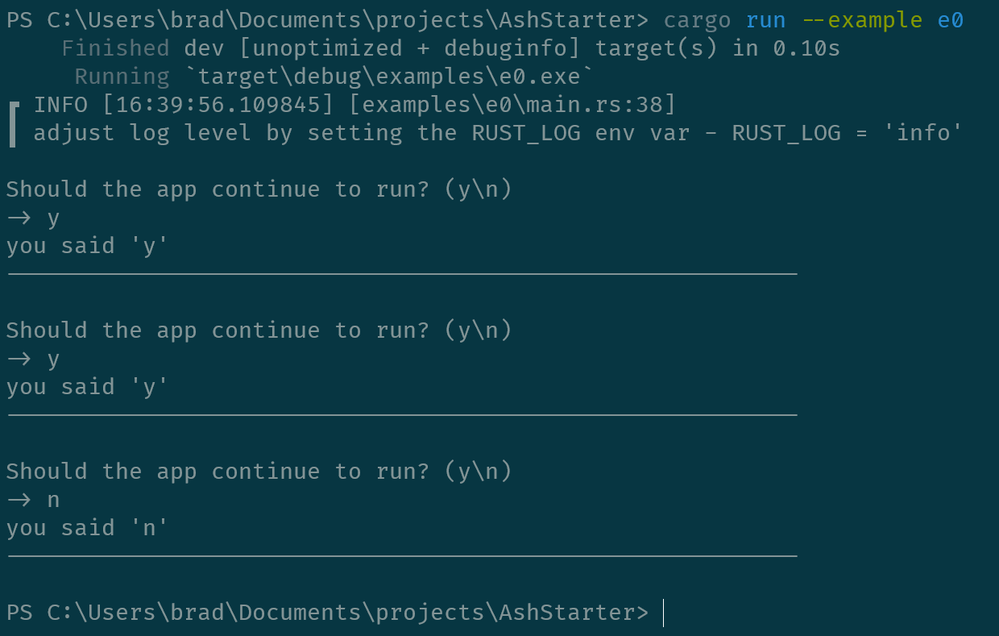

# Hello World

This example is the bare-minimum structure for the other examples. It shows
how the `main()` function manages the lifetime for a stateful application.

The actual application is trivial. It does nothing but repeatedly ask the user
if it should exit, then exits.

## Usage

```
cargo run --example e0
```

## Screenshot


