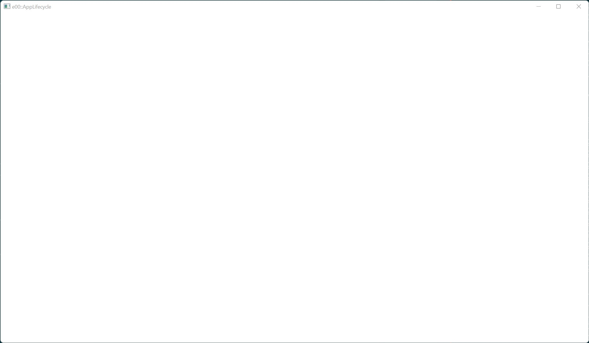

# Example 0 - Application Lifecycle

This example shows how to create a GLFW window which can handle events and
and maintain state.

## Commands

From the project root: `cargo run --example e0`

## Screenshot

