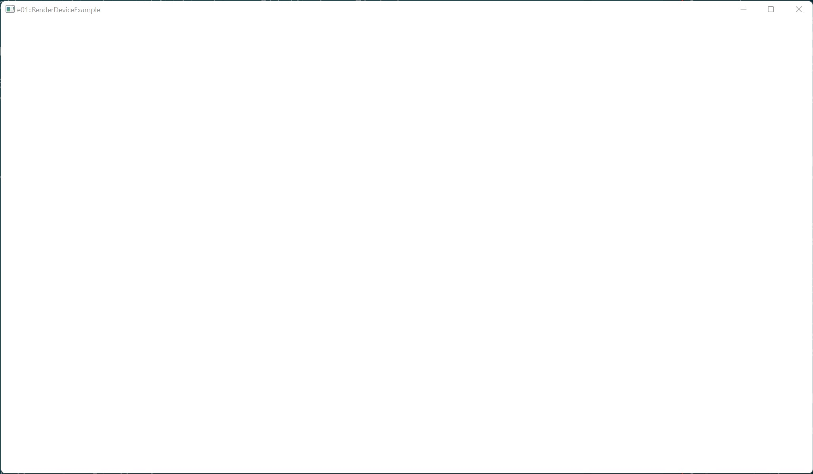

# Example 01 - Render Device

This example shows how to create the Render Device which is used to create and
destroy vulkan resources.

## Commands

From the project root: `cargo run --example e01`

## Screenshot

