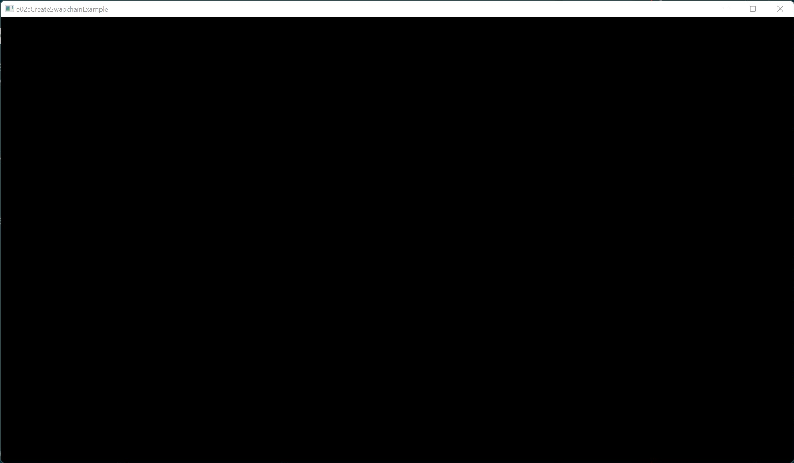

# Example 02 - Swapchain

This example creates a swapchain and uses a memory barrier to transition
swapchain images for presentation.

## Commands

From the project root: `cargo run --example e02`

## Screenshot

