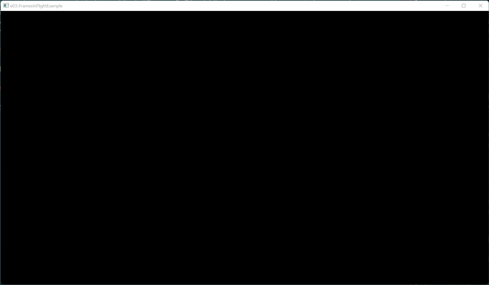

# Example 03 - Frames In Flight

This example uses a utility called "FramesInFlight" to manage the swapchain and
a fixed set of in-flight frames for the application. This allows the application
to have graphics commands for multiple frames executing at the same time. Or,
in other words, have multiple frames "in flight" at the same time.

## Commands

From the project root: `cargo run --example e03`

## Screenshot

