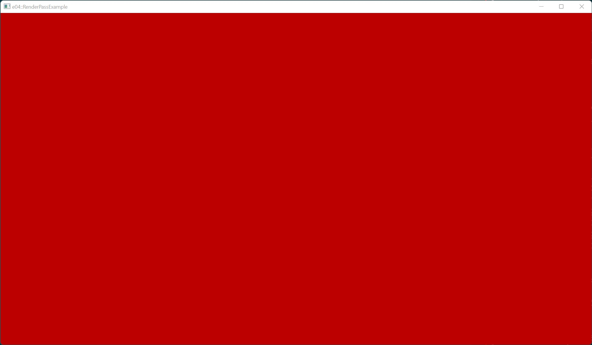

# Example 04 - RenderPass

This example creates a single render pass and uses it to clear the screen
instead of using an image memory barrier.

## Commands

From the project root: `cargo run --example e04`

## Screenshot

