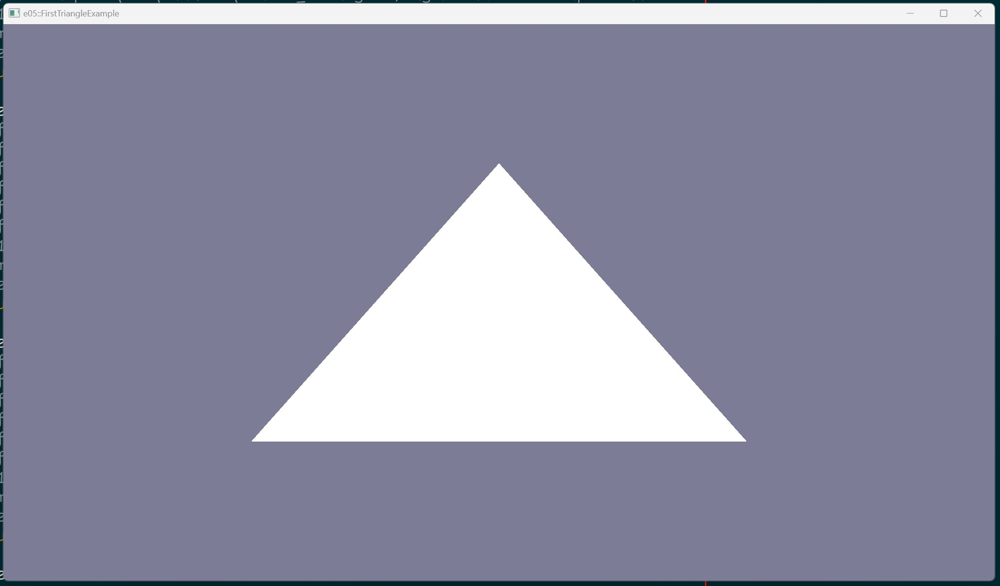

# Example 05 - Triangle

This example creates a graphics pipeline and uses it to render a triangle.

NOTE: no buffers or dynamic memory allocations are used.

## Commands

From the project root: `cargo run --example e05`

## Screenshot

