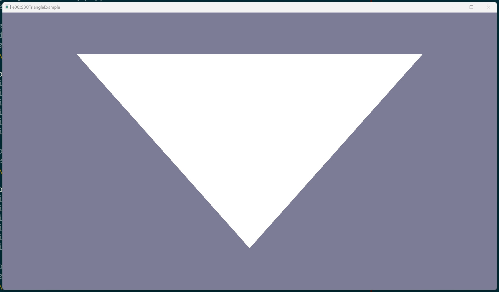

# Example 06 - SBO Triangle

This example creates a graphics pipeline and uses it to render a triangle.

NOTE: Unlike Example 05, this example stores Vertex data in a storage buffer
object which is read by the shader.

## Commands

From the project root: `cargo run --example e06`

## Screenshot

