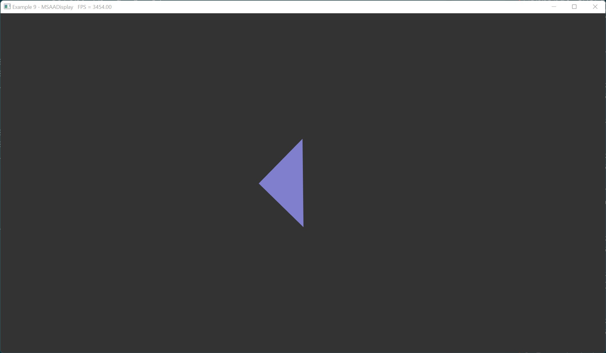

# Example 9 - Multisample Display + SSBO

This example uses the Multisample Display abstraction to manage the swapchain,
framebuffers, and MSAA target for the screen. It's functionally identical to
Example 9, but moves all of the renderpass, framebuffers, and swapchain
management out of the example itself.

Additionally, this example uses a Shader Storage Buffer Object SSBO to provide
vertex data to the shader instead of vertex buffer bindings. This has the
advantage of making vertex input identical to any other input to the shader.
The downside is that vertex input buffers can be more densely packed which can
potentially save on device bandwidth when rendering a lot of vertices.

## Commands

From the project root: `cargo run --example e9`

## Screenshot

