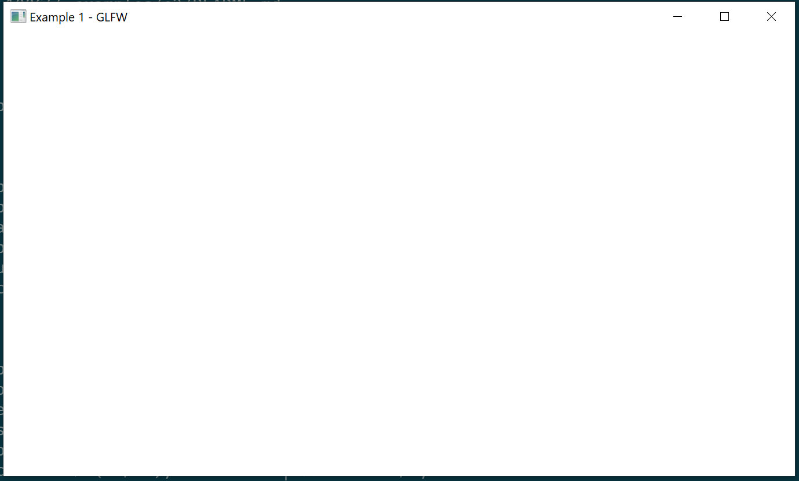

# Hello GLFW

This example shows a bare-minimum GLFW application with an event loop.
GLFW has great cross-platform support for windowing and Vulkan.

## Usage

```
cargo run --example e1
```

## Keybinds

* `Esc` - quit the application

## Screenshot



