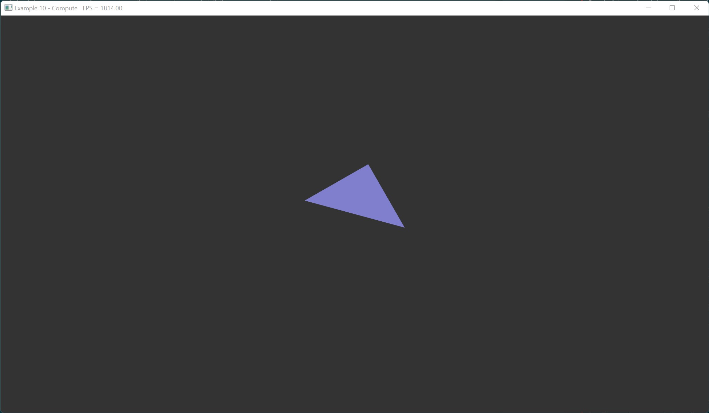

# Example 11 - GPU Particles

This example uses compute shaders to render a GPU-driven particle system.
Pipeline barriers are used to synchronize access to the storage buffer that
holds particle data.

## Commands

From the project root: `cargo run --example e11`

## Screenshot

