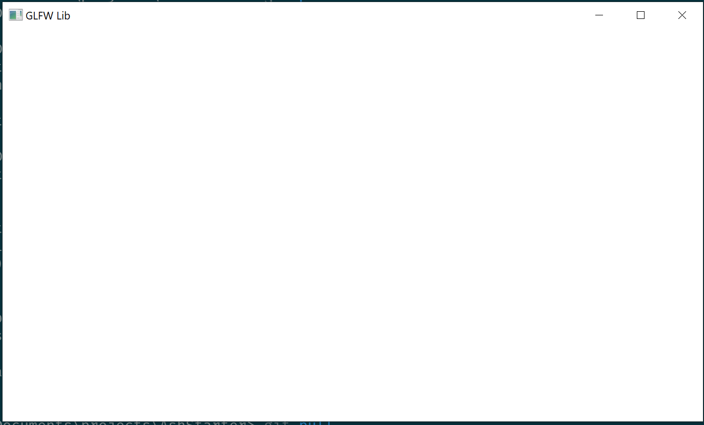

# GLFW Lib

This example shows a GLFW application which uses the wrapper library to manage
GLFW state.

## Usage

```
cargo run --example e2
```

## Keybinds

- `Space + Ctrl`: toggle fullscreen

## Screenshot


