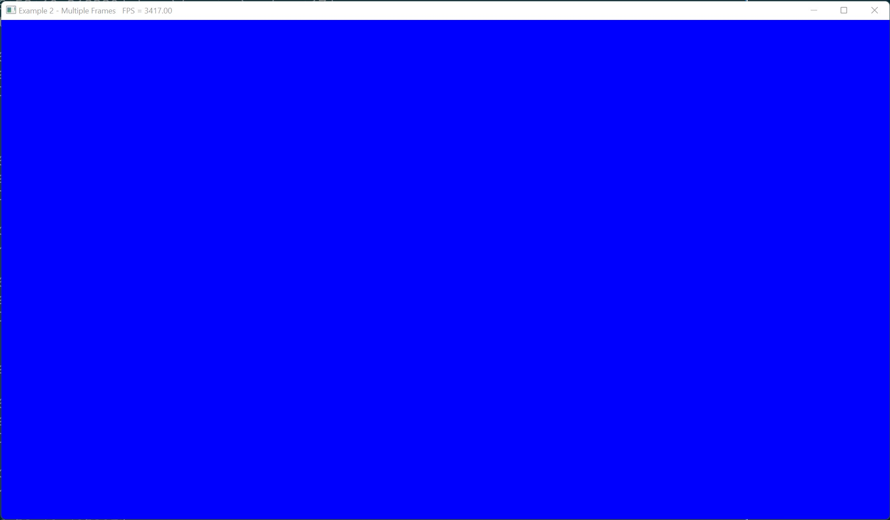

# Example 2 - Multi-Frame Rendering

This example shows how to use separate semaphores and fences for each frame so
that multiple swapchain frames can render at the same time, rather than waiting
for the previous frame to finish rasterizing before starting on the next.

## Commands

From the project root: `cargo run --example e2`

## Screenshot 

