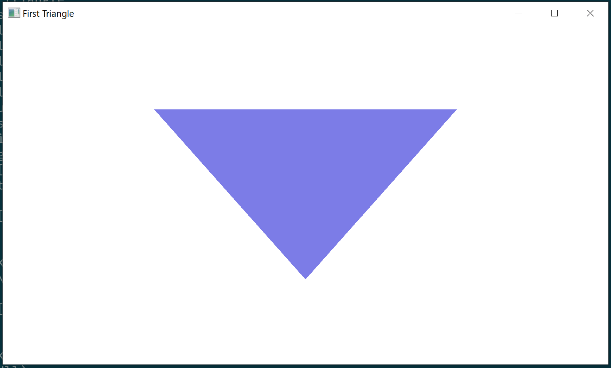

# First Triangle

This example shows how to render a triangle with Vulkan!

## Usage

```
cargo run --example e4
```

## Keybinds

* `Esc` - exit
* `Space + Ctrl` - toggle fullscreen

## Screenshot


