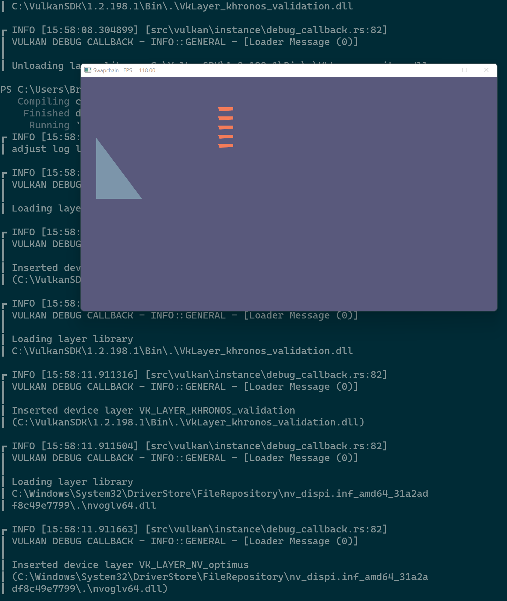

# Renderers

This example uses multiple render passes to prepare frames.


## Usage

```
cargo run --example e5
```

## Keybinds

* `Esc` - exit
* `Space + Ctrl` - toggle fullscreen

## Screenshot


