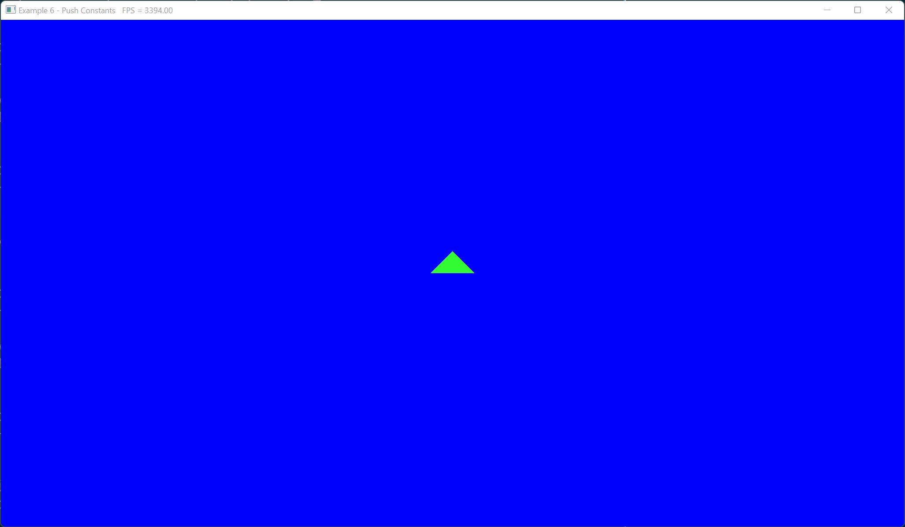

# Example 6 - Push Constants

This example shows how to use push constants to provide small changing values
to shaders.

## Commands

From the project root: `cargo run --example e6`

## Screenshot 

